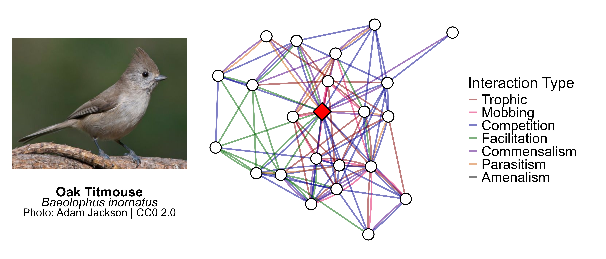
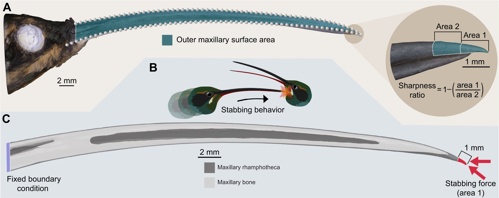
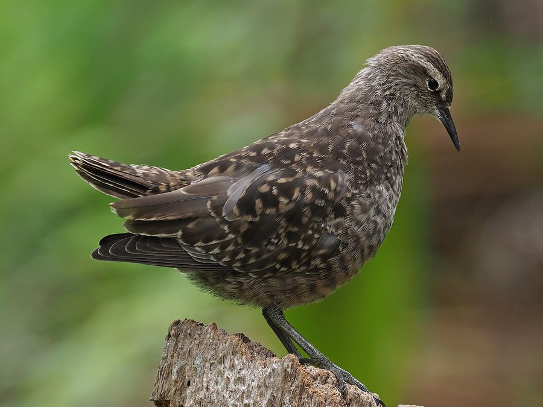
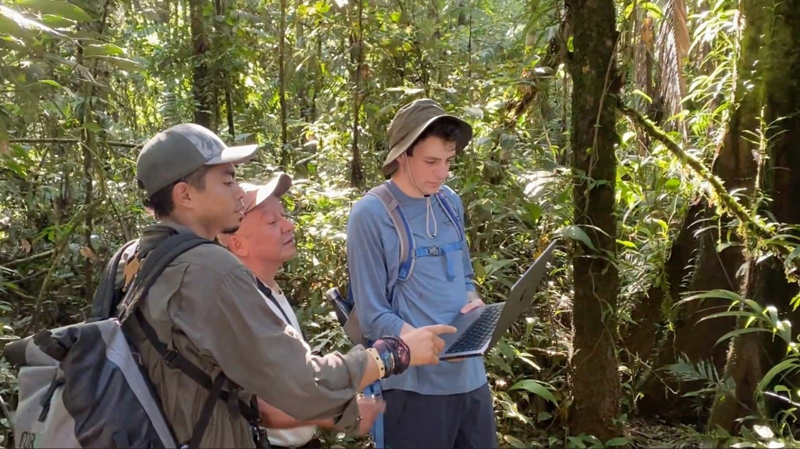
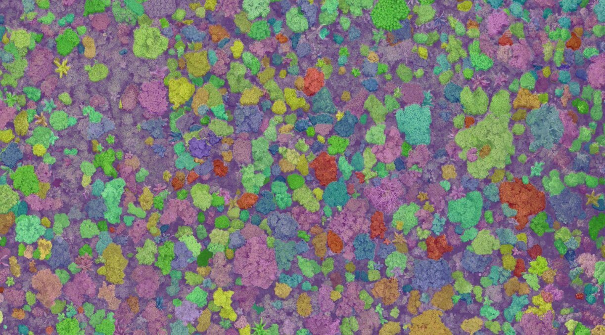
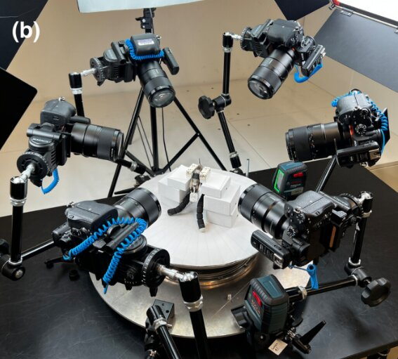

## Current Projects

## The AvianMetaNetwork {style="text-align: center;"}

::::::: columns
:::: {.column width="55%"}
::: {style="text-align: left;"}
Species interactions are a crucial aspect of ecosystem functioning and biodiversity, yet we lack comprehensive information on interactions at broad scales. **The AvianMetaNetwork** is a comprehensive database of bird-bird species interactions that attempts to fill this knowledge gap and enable research that answers macroecological and eco-evolutionary questions about species interactions. The database is built by undergraduates in the SpaCE lab through systematic literature review! Currently, the database is complete for North America (Canada, Alaska and the conterminous United States).

[Project Website](https://avianmetanetwork.github.io/)\
[Project Github](https://github.com/AvianMetaNetwork/AvianMetaNetwork)

*Paper:*\
**The AvianMetaNetwork: biotic interactions among birds of the continental United States and Canada** (In preparation)\
Zarnetske, P., Bills, P., Kapsar, K., **Mansfield, L.**, Parker, E., Roche, C., Hirschowitz, I., DePasquale, G., & Zonneveld, S.\
:::
::::
:::: {.column width="5%"}
::::
:::: {.column width="40%"}
::: {style="text-align: center;"}
{width="400px" height="200px"} 
[Example network generated from the AvianMetaWeb.]{.fig-caption}
:::
::::
:::::::

## Disturbance and Climate on Species Networks at NEON Sites {style="text-align: center;"}

::::::: columns
:::: {.column width = "55%"}
::: {style="text-align: left;"}
This project leverages data from the [National Ecological Observatory Network (NEON)](https://www.neonscience.org/) to study the impacts of anthropogenic disturbance and climate change across the United States. Terrestrial NEON sites contain annually sampled data on breeding birds, ground beetles, plants an small mammals, which is used to produce a taxa list. This is supplemented with interaction data from sources such as the **AvianMetaNetwork** and [Global Biotic Interactions (GloBI)](https://www.globalbioticinteractions.org/) to build species interaction networks. Using rasters of land cover change and climate, I am exploring the factors that cause interaction network strucutre change across space and time.

:::
::::
:::: {.column width="5%"}
::::
:::: {.column width="40%"}
::: {style="text-align: center;"}
{width="100%"}
[Workflow for network analysis at one terrestrial NEON site: Talladega Forest.]{.fig-caption}
:::
::::
:::::::

## Past Projects

## Green Hermit Sexual Dimorphism {style="text-align: center;"}

::::::: columns
:::: {.column width="55%"}
::: {style="text-align: left;"}
Green Hermits (*Phaethornis guy*) are tropical species of hummingbirds that engage in aggressive leks during the breeding season. This species is also notable for its bill sexual dimorphism, in which females have visibly curvier bills than males. Using 3D bill models generated from museum specimens using photogrammetry, we showed that male bills are significantly straighter, stronger and sharper than female bills, indicating the sexual dimorphism might benefit male green hermits who spar with their bills during intense leks.

*Press:*\
[Scientific American](https://www.scientificamerican.com/article/videos-show-hummingbirds-jousting-like-medieval-knights-in-rare-mating/)\
[Smithsonian Magazine](https://www.smithsonianmag.com/smart-news/these-male-hummingbirds-evolved-straighter-sharper-bills-so-they-could-better-joust-for-mates-180987883/)\
[UW News](https://www.washington.edu/news/2025/11/21/sharper-straighter-stiffer-stronger-male-green-hermit-hummingbirds-have-bills-evolved-for-fighting/)\
[Inside JEB](https://journals.biologists.com/jeb/article/228/21/jeb251783/369729/Sharper-straighter-bills-give-male-green-hermits)

*Paper:*\
**Sharper, straighter, stiffer, stronger: sexually dimorphic bill shape enhances male stabbing performance in the green hermit hummingbird (Phaethornis guy)** (2025)  
Garzón-Agudelo, F., **Mansfield, L.**, Epperly, K., Rico-Guevara, A. 
*Journal of Experimental Biology*, 228(21): jeb250769.  
[[PDF]](pdfs/hermit.pdf) [[DOI]](https://doi.org/10.1242/jeb.250769)
:::
::::
:::: {.column width="5%"}
::::
:::: {.column width="40%"}
::: {style="text-align: center;"}
{width="100%"} 
[Graphical abstract of hermit bill measurements.]{.fig-caption}
{fig-align="center" width="75%"}\
[Cover of JEB issue with photo by Jan Lenaert!]{.fig-caption}

:::
::::
:::::::

## Tuamotu Sandpiper and Hyoid Morphology {style="text-align: center;"}

::::::: columns
:::: {.column width="55%"}
::: {style="text-align: left;"}
The Tuamotu Sandpiper (*Prosobonia parvirostris*) is a unique species of shorebird native to the Tuamotu Archipelago of French Polynesia. It has been observed to feed on nectar, a behavior that is exceedingly rare for shorebirds. To investigate the morphological precursors that enable this adaptation (and similar dietary habits like biofilm feeding), we took morphological measurements of the hyoid, bill and skull from species across the Scolopacidae family, and compared these with dietary categorizations. 

*Paper:*\
**Morphology, ecology, and phylogeny of feeding in sandpipers and allies (Aves: Scolopacidae)** (In preparation)\
Edison, I., **Mansfield, L.**, Gous, A., Smith, J., Srinivasan, P., Remmers, A., Epperly, K., & Rico-Guevara, A.\

:::
::::
:::: {.column width="5%"}
::::
:::: {.column width="40%"}
::: {style="text-align: center;"}
{width="100%"}\
[Tuamotu sandpiper (Prosobonia parvirostris). Image by James Eaton from Avicommons.]{.fig-caption}

:::
::::
:::::::

## Rainforest Remote Sensing and Tree Emergence {style="text-align: center;"}

::::::: columns
:::: {.column width="55%"}
::: {style="text-align: left;"}
In 2024, I joined Team Welcome to the Jungle as part of the [XPRIZE Rainforest Competition](https://xprize-org-qa.azurewebsites.net/prizes/rainforest) and [The Morton Arboretum](https://mortonarb.org/)! I traveled to the [Tiputini Biodiversity Station](https://www.tiputini.com/home) in the Ecuadorian Amazon to collect LiDAR and multispectral drone data of the Amazonian canopy. Using trees identified and geotagged on the ground, we developed a method to identify canopy trees using segmentation techniques and multispectral imagery. This technique was used by our team in the finals of the XPRIZE Rainforest Competition in Manaus, Brazil. Later, using the same dataset, we developed a metric for quantifying canopy tree emergence and analyzed patterns of emergence across Tiputini.

*Paper:*\
**Beyond Height: Spatial Distribution of Emergent Trees in the Amazonian Rainforest Using Unmanned Aerial System (UAS) at Tiputini, Ecuador** (In preparation)\
Ho, H. J., Jung, M. Y., **Mansfield, L.**, Cannon, C., Kua, C. S., Rivas-Torres, G., Chang, A. J., & Jung, J.\
:::
::::
:::: {.column width="5%"}
::::
:::: {.column width="40%"}
::: {style="text-align: center;"}
{width="100%"}\
[Collecting data at Tiputini.]{.fig-caption}

{width="100%"}\
[Segmentation of Tiputini canopy trees.]{.fig-caption}
:::
::::
:::::::

## PicoCam: Photogrammetry {style="text-align: center;"}

::::::: columns
:::: {.column width="55%"}
::: {style="text-align: left;"}
PicoCam is a device at the [Burke Museum of Natural History and Culture](https://www.burkemuseum.org/) that uses photogrammetry to build 3D models of bird bills from a series of 2D photos. This method allows biologists to get complex morphological measurements (such as sharpness or curvature) with a high degree of accuracy from living organisms in the field. PicoCam has aided several morphological studies at the Burke (see the Green Hermit Project) and is currently being used to build a library of bird bill models.

*Press:*\
[Burke Museum](https://www.burkemuseum.org/news/behind-glass-hummingbird-supermodels-using-photography-create-3d-models)

*Paper:*\
**PicoCam: High-resolution 3D imaging of live animals and preserved specimens** (2024)  
Medina, J., Irschick, D., Epperly, K., Cuban, D., Elting, R., **Mansfield, L.**, Lee, N., Fernandes, A. M., Garzón-Agudelo, F., Rico-Guevara, A. 
*Methods in Ecology and Evolution*, 15(11), 1980-1989.  
[[PDF]](pdfs/picocam.pdf) [[Data]](https://datadryad.org/dataset/doi:10.5061/dryad.05qfttfc0) [[DOI]](https://doi.org/10.1111/2041-210X.14409)

:::
::::
:::: {.column width="5%"}
::::
:::: {.column width="40%"}
::: {style="text-align: center;"}
{width="100%"}\
[PicoCam setup at the Burke.]{.fig-caption}

:::
::::
:::::::